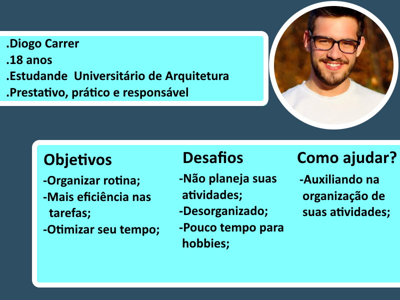
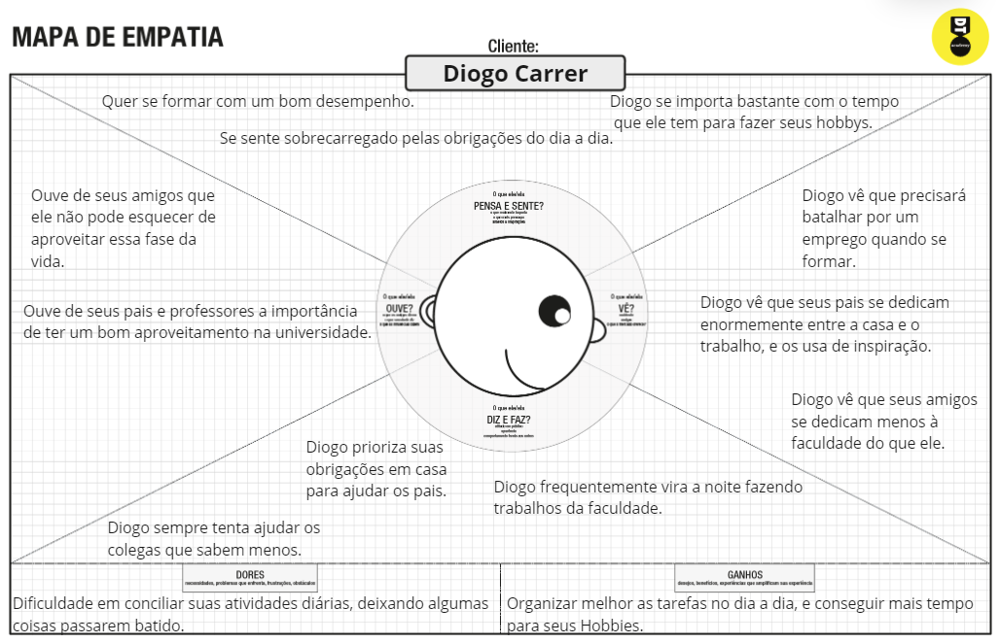
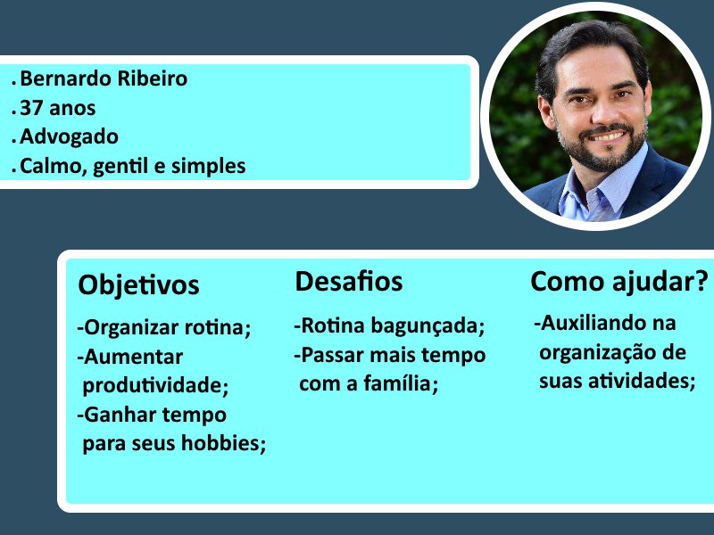
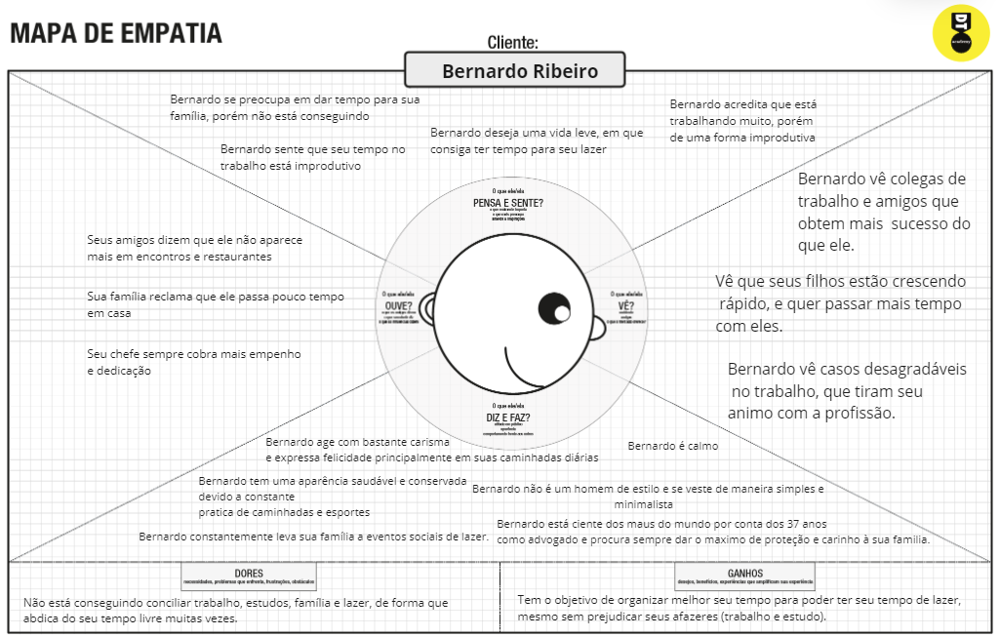
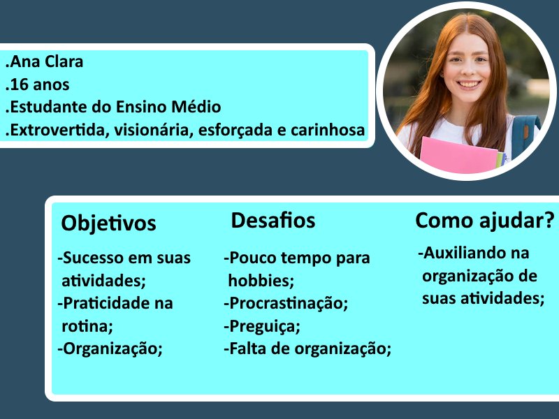
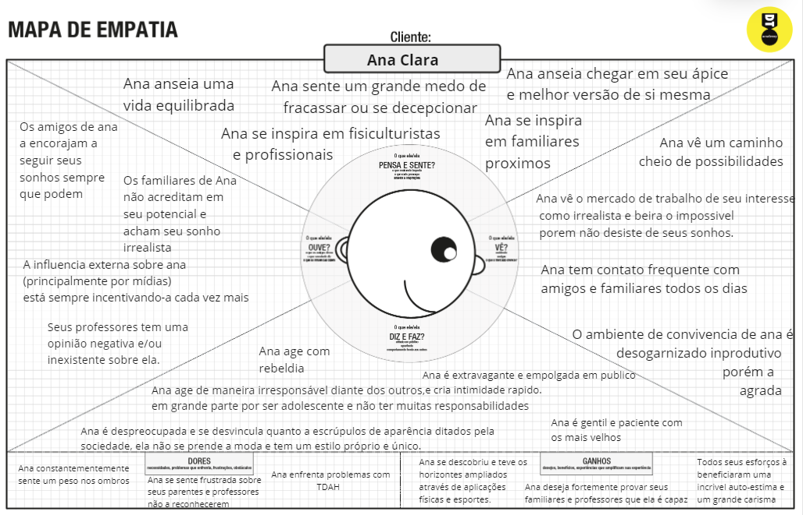
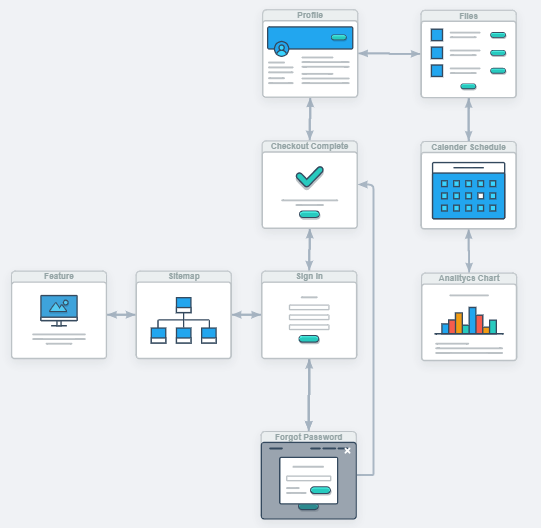
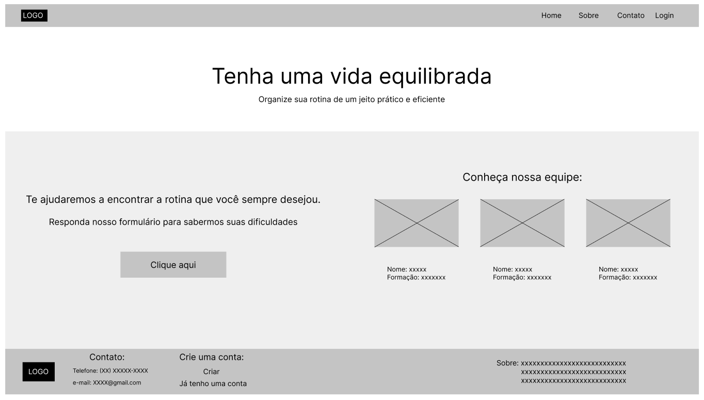
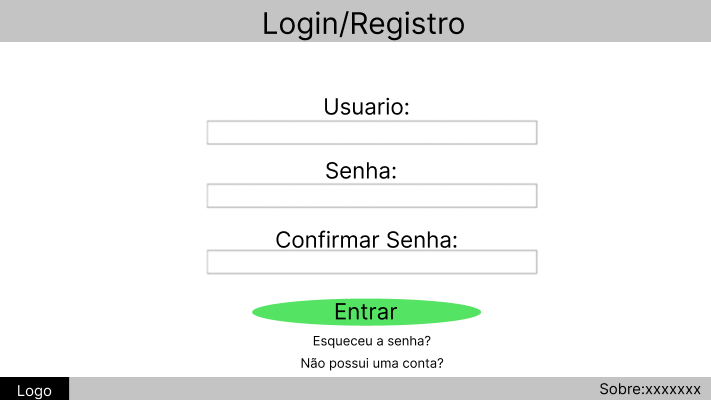
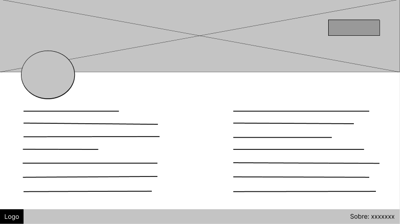

# Informações do Projeto
  

BoAgenda

Trabalho Interdisciplicar de Aplicações Web - Ciências da Computação

## Participantes

>
> Os membros do grupo são: 
> - Cristiano Silva Robini Macedo
> - João Pedro Nascimento Fernandes
> - Kauhan Roger Neves Teodoro
> - Tiago Augusto Simionato Tozo

# Estrutura do Documento

- [Informações do Projeto](#informações-do-projeto)
  - [Participantes](#participantes)
- [Estrutura do Documento](#estrutura-do-documento)
- [Introdução](#introdução)
  - [Problema](#problema)
  - [Objetivos](#objetivos)
  - [Justificativa](#justificativa)
  - [Público-Alvo](#público-alvo)
- [Especificações do Projeto](#especificações-do-projeto)
  - [Personas e Mapas de Empatia](#personas-e-mapas-de-empatia)
  - [Histórias de Usuários](#histórias-de-usuários)
  - [Requisitos](#requisitos)
    - [Requisitos Funcionais](#requisitos-funcionais)
    - [Requisitos não Funcionais](#requisitos-não-funcionais)
  - [Restrições](#restrições)
- [Projeto de Interface](#projeto-de-interface)
  - [User Flow](#user-flow)
  - [Wireframes](#wireframes)
- [Metodologia](#metodologia)
  - [Divisão de Papéis](#divisão-de-papéis)
  - [Ferramentas](#ferramentas)
  - [Controle de Versão](#controle-de-versão)
- [**############## SPRINT 1 ACABA AQUI #############**](#-sprint-1-acaba-aqui-)
- [Projeto da Solução](#projeto-da-solução)
  - [Tecnologias Utilizadas](#tecnologias-utilizadas)
  - [Arquitetura da solução](#arquitetura-da-solução)
- [Avaliação da Aplicação](#avaliação-da-aplicação)
  - [Plano de Testes](#plano-de-testes)
  - [Ferramentas de Testes (Opcional)](#ferramentas-de-testes-opcional)
  - [Registros de Testes](#registros-de-testes)
- [Referências](#referências)

# Introdução

## Problema

Diariamente, precisamos escolher o que vamos fazer com o tempo limitado que temos, e, infelizmente, muitas pessoas têm dificuldade em organizar sua rotina, resultando em perda de produtividade, atraso ou não entrega de tarefas e desorganização, comprometendo diversas áreas de suas vidas.

## Objetivos

Montar uma aplicação que auxilie as pessoas a organizarem melhor suas rotinas, de modo que consigam ser mais produtivas no trabalho e/ou estudos, e também ter tempo   para hobbies e atividades de lazer.
  Objetivos específicos:
   - Descobrir quais métodos são mais eficazes para uma boa organização.
   - Permitir que o usuário ranqueie a prioridade de suas tarefas, para ajudá-lo a definir prioridades.

## Justificativa

Escolhemos esse tema pois, pelas pesquisas e também pelo contato com pessoas próximas, percebemos que muitas delas possuem dificuldade em fazer uma rotina que equilibre compromissos e lazer. Assim, buscamos realizar uma plataforma que ajude a montar rotinas de modo que o usuário seja mais produtivo no trabalho e tenha tempo para seus hobbies, também o ajudando a identificar suas prioridades.

## Público-Alvo

Pessoas de qualquer gênero e idade que possuem dificuldade em organizar a rotina e/ou desejam migrar para uma agenda virtual são um público válido. Mas como esse problema é tão abrangente, avaliamos os resultados de nossa pesquisa e decidimos estreitar um pouco nosso foco para estudantes e adultos que trabalham.
 
# Especificações do Projeto

Nessa parte do projeto, realizamos pesquisas, através do Google Forms, e com os resultados montamos nossas personas e mapas de empatia, pelo Miro.

## Personas e Mapas de Empatia

## Histórias de Usuários

Com base na análise das personas forma identificadas as seguintes histórias de usuários:

|EU COMO... `PERSONA`| QUERO/PRECISO ... `FUNCIONALIDADE` |PARA ... `MOTIVO/VALOR`                 |
|--------------------|------------------------------------|----------------------------------------|
|Diogo Carrer        | Cadastrar suas atividades diárias  | Não deixar de fazer por esquecimento   |
|Diogo Carrer        | Ver as atividades já realizadas    | Manter controle de o que já foi feito  |
|Bernardo Ribeiro    | Organizar atividades prioritárias  | Dedicar seu tempo no mais relevante    |
|Bernardo Ribeiro    | Editar as atividades em andamento  | Não precisar criar novas atividades    |
|Ana Clara           | Ordenar as atividades              | Identificar as atividades urgentes     |
|Ana Clara           | Desistir de uma atividade sem removê-la   | Saber quais atividades ela não está conseguindo realizar  |

## Requisitos

As tabelas que se seguem apresentam os requisitos funcionais e não funcionais que detalham o escopo do projeto.

### Requisitos Funcionais

|ID    | Descrição do Requisito  | Prioridade |
|------|-----------------------------------------|----|
|RF-001| Criação de Cards | ALTA | 
|RF-002| Cards Editáveis   | ALTA |
|RF-003| Gráfico de Eficiência   | BAIXA |
|RF-004| Múltipla funcionalidade e possibilidades na criação de cards   | MÉDIA |
|RF-005| Possível calendario para ter uma visão periférica de todos os afazeres   | MÉDIA |
|RF-006| Nível de Importância bem definida (ex: por cores[verde,amarelo, vermelho] ou negrito)   | ALTA |
|RF-007| Cadastro e/ou opção de projetos públicos/privados   | MÉDIA |

### Requisitos não Funcionais

|ID     | Descrição do Requisito  |Prioridade |
|-------|-------------------------|----|
|RNF-001| Interface de cores manipuláveis | BAIXA | 
|RNF-002| Upload de arquivos e perfil |  MÉDIA | 
|RNF-003| O sistema deve ser responsivo e rodar em um dispositivo mobile |  MÉDIA |
|RNF-004| Adição de outros editores à um mesmo projeto dada a permissão do criador |  MÉDIA |

## Restrições

O projeto está restrito pelos itens apresentados na tabela a seguir.

|ID| Restrição                                             |
|--|-------------------------------------------------------|
|01| O projeto deverá ser entregue até o final do semestre |
|02| Não pode ser desenvolvido um módulo de backend        |
|03| O projeto deve ser feito usando o GitHub        |
|04| O projeto precisa ser dividido entre os quatro membros      |
|05| É obrigatório usar estratégias de Design Thinking e metodologia Scrum      |

# Projeto de Interface

Na parte das interfaces montamos três wireframes principais, sendo eles a tela de ínicio, a tela de login e o perfil do usuário.

## User Flow

## Wireframes

Wireframe Tela de Início

Wireframe Login

Wireframe Perfil do Usuário

# Metodologia

A metodologia que nós usamos é o Scrum, usamos o Discord para as reuniões, e usaremos o Trello para dividir as tarefas.
Os arquivos são mantidos no Google Drive, para arquivos de edição síncrona, e o resto é mantido no GitHub através do GitHub Classroom.
Nossa pesquisa foi feita pela estratégia de Design Thinking, usando o Miro como ferramenta, e nossas entrevistas foram feitas através de um formulário do Google Forms.
Os Wireframes foram feitos através do Figma e o User Flow através do Wireflow.

## Divisão de Papéis

Dada a natureza do nosso trabalho, não é possível ter verdadeiramente um Product Owner e um Scrum Master, principalmente porque todos precisam ser desenvolvedores, então essas tarefas foram feitas com a finalidade de aprendizado por membros que também são desenvolvedores.

 - Cristiano Silva Robini Macedo: Desenvolvedor
 - João Pedro Nascimento Fernandes: Desenvolvedor
 - Kauhan Roger Neves Teodoro: Desenvolvedor
 - Tiago Augusto Simionato Tozo: Desenvolvedor

## Ferramentas

| Ambiente  | Plataforma              |Link de Acesso |
|-----------|-------------------------|---------------|
|Processo de Design Thinkgin  | Miro |  https://miro.com/app/board/uXjVOBuP2E0=/ | 
|Repositório de código | GitHub | https://github.com/ICEI-PUC-Minas-PPLCC-TI/tiaw-ppl-cc-m-20221-t3-g3-dificuldade-de-organizar-rotina | 
|Protótipo Interativo | Figma |  https://www.figma.com/file/UWc3V7jHC5c3T1i8KNRLy2/Untitled?node-id=0%3A1 | 
|Comunicação | Discord | https://discord.com/ | 
|Editor de Código | Visual Studio Code | https://code.visualstudio.com/ | 
|User Flow | Wireflow | https://wireflow.co/ | 

## Controle de Versão

A ferramenta de controle de versão que utilizamos é o Git. Ainda não adotamos nenhuma metodologia de organização para o projeto.

# **############## SPRINT 1 ACABA AQUI #############**

# Projeto da Solução

......  COLOQUE AQUI O SEU TEXTO ......

## Tecnologias Utilizadas

......  COLOQUE AQUI O SEU TEXTO ......

> Descreva aqui qual(is) tecnologias você vai usar para resolver o seu
> problema, ou seja, implementar a sua solução. Liste todas as
> tecnologias envolvidas, linguagens a serem utilizadas, serviços web,
> frameworks, bibliotecas, IDEs de desenvolvimento, e ferramentas.
> Apresente também uma figura explicando como as tecnologias estão
> relacionadas ou como uma interação do usuário com o sistema vai ser
> conduzida, por onde ela passa até retornar uma resposta ao usuário.
> 
> Inclua os diagramas de User Flow, esboços criados pelo grupo
> (stoyboards), além dos protótipos de telas (wireframes). Descreva cada
> item textualmente comentando e complementando o que está apresentado
> nas imagens.

## Arquitetura da solução

......  COLOQUE AQUI O SEU TEXTO E O DIAGRAMA DE ARQUITETURA .......

> Inclua um diagrama da solução e descreva os módulos e as tecnologias
> que fazem parte da solução. Discorra sobre o diagrama.
> 
> **Exemplo do diagrama de Arquitetura**:
> 
> 

# Avaliação da Aplicação

......  COLOQUE AQUI O SEU TEXTO ......

> Apresente os cenários de testes utilizados na realização dos testes da
> sua aplicação. Escolha cenários de testes que demonstrem os requisitos
> sendo satisfeitos.

## Plano de Testes

......  COLOQUE AQUI O SEU TEXTO ......

> Enumere quais cenários de testes foram selecionados para teste. Neste
> tópico o grupo deve detalhar quais funcionalidades avaliadas, o grupo
> de usuários que foi escolhido para participar do teste e as
> ferramentas utilizadas.
> 
> **Links Úteis**:
> - [IBM - Criação e Geração de Planos de Teste](https://www.ibm.com/developerworks/br/local/rational/criacao_geracao_planos_testes_software/index.html)
> - [Práticas e Técnicas de Testes Ágeis](http://assiste.serpro.gov.br/serproagil/Apresenta/slides.pdf)
> -  [Teste de Software: Conceitos e tipos de testes](https://blog.onedaytesting.com.br/teste-de-software/)

## Ferramentas de Testes (Opcional)

......  COLOQUE AQUI O SEU TEXTO ......

> Comente sobre as ferramentas de testes utilizadas.
> 
> **Links Úteis**:
> - [Ferramentas de Test para Java Script](https://geekflare.com/javascript-unit-testing/)
> - [UX Tools](https://uxdesign.cc/ux-user-research-and-user-testing-tools-2d339d379dc7)

## Registros de Testes

......  COLOQUE AQUI O SEU TEXTO ......

> Discorra sobre os resultados do teste. Ressaltando pontos fortes e
> fracos identificados na solução. Comente como o grupo pretende atacar
> esses pontos nas próximas iterações. Apresente as falhas detectadas e
> as melhorias geradas a partir dos resultados obtidos nos testes.

# Referências

......  COLOQUE AQUI O SEU TEXTO ......

> Inclua todas as referências (livros, artigos, sites, etc) utilizados
> no desenvolvimento do trabalho.
> 
> **Links Úteis**:
> - [Formato ABNT](https://www.normastecnicas.com/abnt/trabalhos-academicos/referencias/)
> - [Referências Bibliográficas da ABNT](https://comunidade.rockcontent.com/referencia-bibliografica-abnt/)
